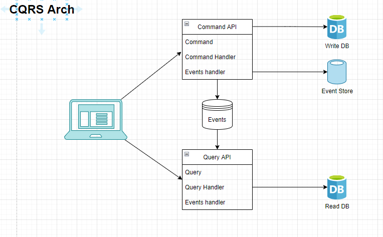
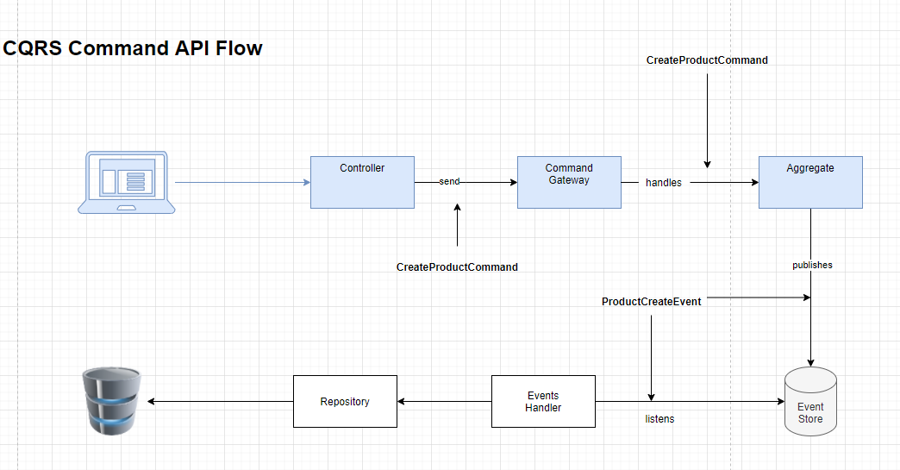

## 意图

CQRS 是一种将查询和命令分离的模式.

## 适用性

- 当查询和命令需要分离的时候
- 当你想要使用诸如event sourcing 或者 task based UI 这类架构的时候
- 当你想要使用不同的数据模型,在处理复杂领域的时候是很有用的

CQRS 通常要结合event-driven模式一起来使用, 下图是CQRS的一个基本架构

## 使用AxonFrameWork 实现CQRS

上图为AxonFrmework 的一个Command工作流, 首先用户请求